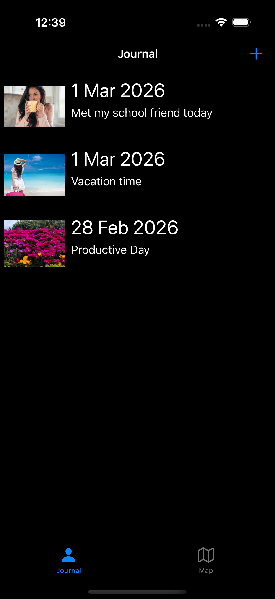
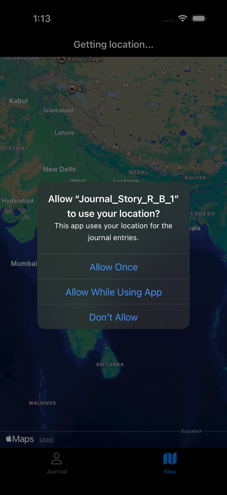
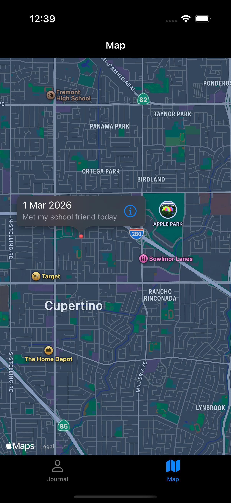
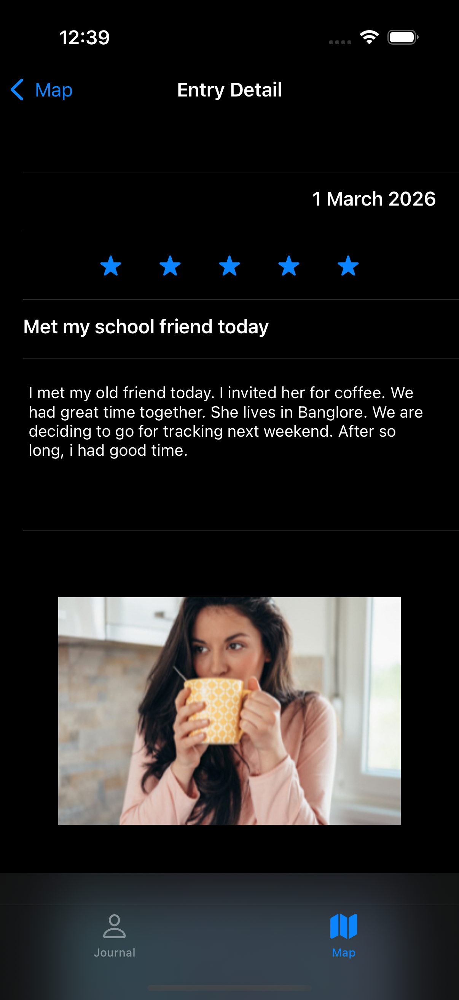

JournalStory 📔

JournalStory is a native iOS journaling application that enables users to create, organize, and visualize personal journal entries. Each entry can include text, photos, star ratings, and location data, with map-based visualization for location-aware journaling.

The project is built entirely using UIKit and Apple’s native frameworks, focusing on clean architecture, data persistence, and real-world iOS development practices.

✨ Features
📝 Core Journaling
- Create and manage journal entries with titles and detailed body text
- Automatic timestamping for each entry
- Interactive 5-star rating system

📸 Media & 📍 Location
- Attach photos using the camera (physical device) or photo library (simulator)
- Capture geolocation data (latitude & longitude) for journal entries
- Adaptive media handling for simulator and real devices

🗺️ Map Visualization
- Display journal entries on an interactive map
- Each entry appears as a map annotation
- Tap annotations to view entry details

🔍 Search & Organization
- Search journal entries by title using UISearchController
- Browse entries in a responsive collection view
- Long-press context menu for quick deletion
- Dynamic layout adaptation for orientation changes

💾 Data Persistence
- Local JSON-based data storage using FileManager
- Automatic save and load on app launch
- No third-party dependencies

## Screenshots

<table align="center">
  <tr>
    <td align="center">
      <br/>
      <b>Journal List Screen</b>
    </td>
    <td align="center">
      <br/>
      <b>Location Permission</b>
    </td>
  </tr>
  <tr>
    <td align="center">
      <br/>
      <b>Map → Journal Detail</b>
    </td>
    <td align="center">
      <br/>
      <b>Map → Journal Detail (Alternate)</b>
    </td>
  </tr>
</table>

🧱 Architecture

The app follows a modular MVC (Model–View–Controller) architecture with clear separation of responsibilities.

Models:
1. JournalEntry:
- Core data model
- Conforms to Codable and MKAnnotation
- Stores title, body, timestamp, rating, photo, and location data

2. SharedData:
- Thread-safe singleton for data management
- Handles JSON encoding/decoding
- Provides CRUD operations for journal entries

View Controllers:
1. JournalListViewController – Browse and search journal entries
2. AddJournalEntryViewController – Create new journal entries
3. JournalEntryDetailViewController – View entry details
4. MapViewController – Map-based visualization of entries

Custom Views:
1. RatingView – Reusable interactive 5-star rating component
2. JournalListCollectionViewCell – Collection view cell for displaying entries

🛠️ Tech Stack
- Language: Swift
- UI Framework: UIKit
- Apple APIs:
- Core Location
- MapKit
- FileManager
- Architecture: MVC
- IDE: Xcode

📋 Requirements
iOS 14.0 or later
Xcode 13.0 or later
Swift 5.0+

🚀 Getting Started
Installation

Clone the repository:

git clone https://github.com/bhardwajritika/JournalStory.git
cd JournalStory

Open the project in Xcode:
- open JournalStory.xcodeproj
- Build and run the app:
- Select a simulator or physical device
- Press Cmd + R

Prerequisites

No external libraries, CocoaPods, or Swift Package Manager dependencies are required.
The app uses only Apple’s native frameworks.

📱 Usage:

Creating a Journal Entry:
1. Tap the “+” button
2. Enter a title and journal content
3. (Optional) Add a photo
4. (Optional) Enable location capture
5. Set a star rating
6. Tap Save

Viewing Entries
1. Browse entries in the main collection view
2. Each entry displays its title and creation date
3. Searching Entries
4. Use the search bar to filter entries by title in real time

Map View
1. Open the Map screen
2. Grant location permission when prompted
3. View journal entries as map annotations
4. Tap an annotation to see entry details

Deleting Entries
1. Long-press any journal entry
2. Select Delete from the context menu

## 📁 Project Structure

```
JournalStory/
├── Model/
│   ├── JournalEntry.swift
│   └── SharedData.swift
│
├── View/
│   ├── JournalListCollectionViewCell.swift
│   ├── RatingView.swift
│
├── Controllers/
│   ├── JournalListViewController.swift
│   ├── AddJournalEntryViewController.swift
│   ├── JournalEntryDetailViewController.swift
│   └── MapViewController.swift
│
├── Base.lproj/
│
├── AppDelegate.swift
├── SceneDelegate.swift
└── Info.plist
```

🔐 Permissions

The app requests the following permissions:
1. Location Services – To tag journal entries and display them on the map
2. Camera / Photo Library – To attach photos to journal entries
Permissions are requested only when the related feature is used.

💾 Data Storage: 
Journal entries are stored locally as a JSON file in the app’s Documents directory
Each entry includes:
1. UUID
2. Timestamp
3. Title and body text
4. Star rating (0–5)
5. Photo data (if provided)
6. Location coordinates (if captured)
